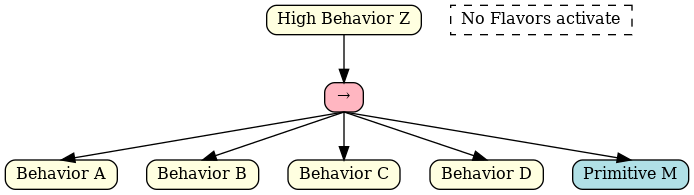
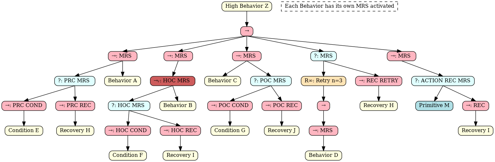

# Using Ontologies for Adaptive Planning and Robust Execution in Robotic Manipulation


## Description

This repository contains the knowledge files supporting the implementation and evaluation of methods presented in the paper **"Using Ontologies for Adaptive Planning and Robust Execution in Robotic Manipulation"**. This work was presented at the **Planning and Ontology Workshop (PLATO'25)**, September 9, 2025, Catania, Italy.


## Citation

This dataset repository corresponds to the following publication:

```bibtex
@inproceedings{ruiz_celada_2025_plato,
  author    = {Ruiz-Celada, Oriol and
               Molina, Victor and
               Su\'{a}rez, Ra\'{u}l and
               Muhayyuddin and
               Zaplana, Isiah and
               Rosell, Jan},
  title     = {Using Ontologies for Adaptive Planning and Robust Execution 
               in Robotic Manipulation},
  booktitle = {Proceedings of the Planning and Ontology Workshop (PLATO'25)},
  year      = {2025},
  month     = sep,
  address   = {Catania, Italy},
  publisher = {Zenodo},
  doi       = {10.5281/zenodo.18682757},
  url       = {https://doi.org/10.5281/zenodo.18682757}
}
```

---


## MRS Structures

This section illustrates the Monitoring and Recovery Structures (MRS) presented in the work. 

The implemented MRS are:
- **Precondition**: Validates required conditions before executing a behavior
- **Holdcondition**: Monitors conditions continuously during behavior execution
- **Postcondition**: Verifies expected outcomes after behavior completion
- **Action Recovery**: Provides alternative behaviors when primary action fails
- **Retry**: Enables multiple execution attempts with configurable limits

The examples in this repository use generic behaviors (Behavior A, Behavior B, Condition I, etc.) to illustrate the functioning. Dummy flavors have been implemented to demonstrate the automatic application of MRS structures when generating Behavior Trees with ontological knowledge support.

**Case 1: No Flavors**

This is the base behavior without any MRS flavors applied.



**Case 2: Individual MRS**

This example shows a behavior where a different MRS has been individually applied to each of the sub-behaviors.




**Case 3: Combined MRS**

This example demonstrates how all five MRS structures have been applied to Subbehavior A, showing how they can be combined with one another.


## Authors

- **Oriol Ruiz-Celada**  
  Institute of Industrial and Control Engineering  
  Universitat Politècnica de Catalunya, Barcelona, Spain  
  Email: oriol.ruiz.celada@upc.edu  


- **Victor Molina**  
  Institute of Industrial and Control Engineering  
  Universitat Politècnica de Catalunya, Barcelona, Spain  
  Email: victor.molina@upc.edu  


- **Raúl Suárez**  
  Institute of Industrial and Control Engineering  
  Universitat Politècnica de Catalunya, Barcelona, Spain  
  Email: raul.suarez@upc.edu  


- **Muhayyuddin**  
  Institute of Industrial and Control Engineering  
  Universitat Politècnica de Catalunya, Barcelona, Spain  
  Email: muhayyuddin@upc.edu  


- **Isiah Zaplana**  
  Institute of Industrial and Control Engineering  
  Universitat Politècnica de Catalunya, Barcelona, Spain  
  Email: isiah.zaplana@upc.edu  


- **Jan Rosell** (Corresponding Author)  
  Institute of Industrial and Control Engineering  
  Universitat Politècnica de Catalunya, Barcelona, Spain  
  Email: jan.rosell@upc.edu  


### Correspondence

For any inquiries regarding this repository or the associated paper, please contact the corresponding author: **Oriol Ruiz-Celada** at [oriol.ruiz.celada@upc.edu](mailto:oriol.ruiz.celada@upc.edu).